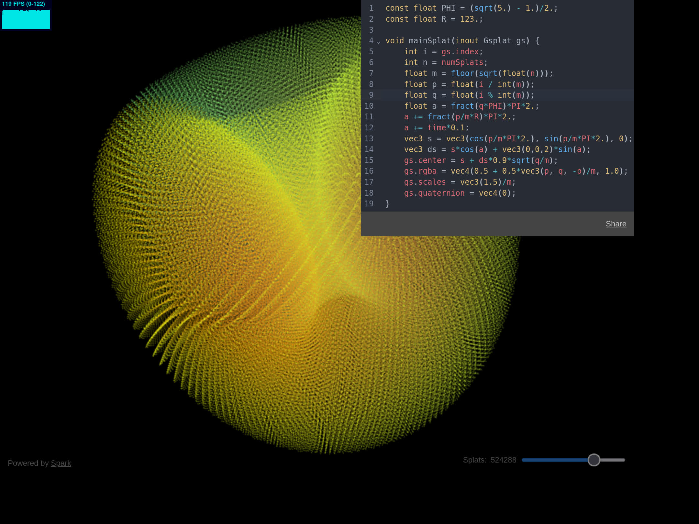

<a href="https://splatmesh.com">splatmesh.com</a>

Procedurally generated splats powered by <a href="https://sparkjs.dev">Spark</a>

 

Another interesting [example](https://splatmesh.com/#const%20float%20PHI%20%3D%20(sqrt(5.)%20-%201.)%2F2.%3B%0Aconst%20float%20R%20%3D%20123.%3B%0A%0Avoid%20mainSplat(inout%20Gsplat%20gs)%20%7B%0A%20%20%20%20int%20i%20%3D%20gs.index%3B%0A%20%20%20%20int%20n%20%3D%20numSplats%3B%0A%20%20%20%20float%20m%20%3D%20floor(sqrt(float(n)))%3B%0A%20%20%20%20float%20p%20%3D%20float(i%20%2F%20int(m))%3B%0A%20%20%20%20float%20q%20%3D%20float(i%20%25%20int(m))%3B%0A%20%20%20%20float%20a%20%3D%20fract(q*PHI)*PI*2.%3B%0A%20%20%20%20a%20%2B%3D%20fract(p%2Fm*R)*PI*2.%3B%0A%20%20%20%20a%20%2B%3D%20time*0.1%3B%0A%20%20%20%20vec3%20s%20%3D%20vec3(cos(p%2Fm*PI*2.)%2C%20sin(p%2Fm*PI*2.)%2C%200)%3B%0A%20%20%20%20vec3%20ds%20%3D%20s*cos(a)%20%2B%20vec3(0%2C0%2C2)*sin(a)%3B%0A%20%20%20%20gs.center%20%3D%20s%20%2B%20ds*0.9*sqrt(q%2Fm)%3B%0A%20%20%20%20gs.rgba%20%3D%20vec4(0.5%20%2B%200.5*vec3(p%2C%20q%2C%20-p)%2Fm%2C%201.0)%3B%0A%20%20%20%20gs.scales%20%3D%20vec3(1.5)%2Fm%3B%0A%20%20%20%20gs.quaternion%20%3D%20vec4(0)%3B%0A%7D):

