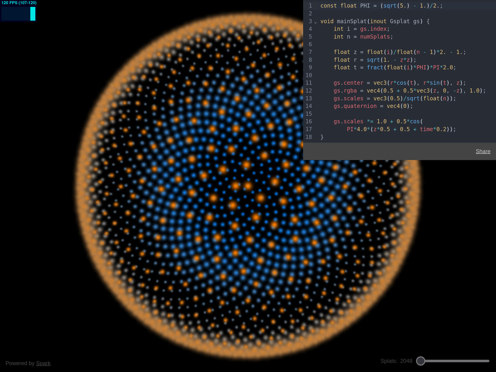
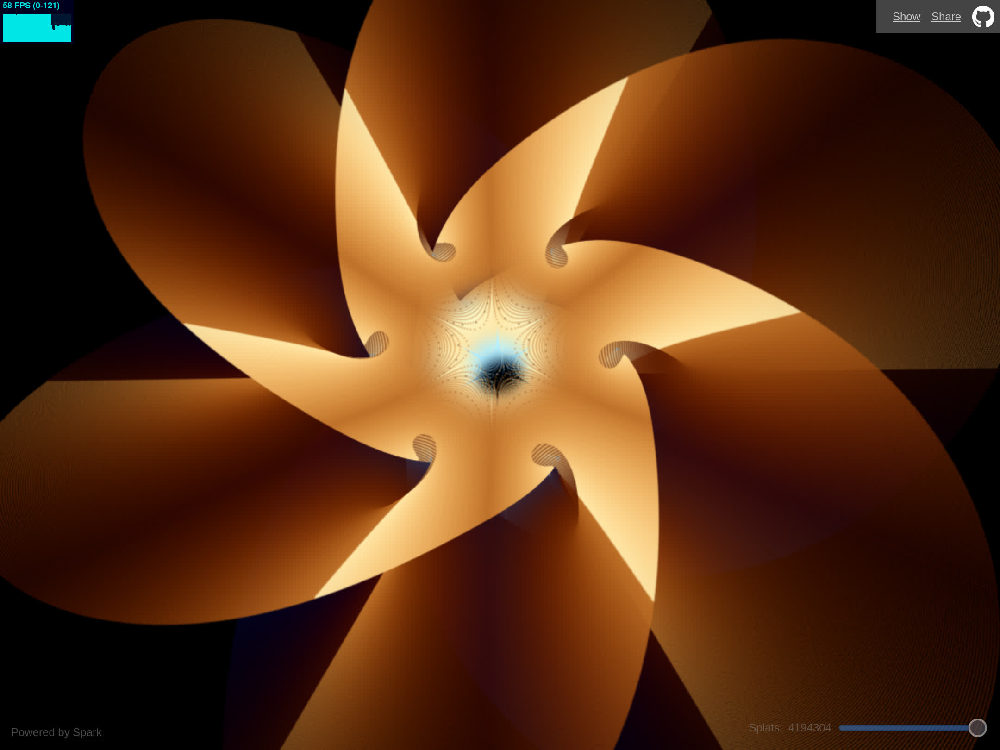

<a href="https://splatmesh.com">splatmesh.com</a>

Procedurally generated splats powered by <a href="https://sparkjs.dev">Spark</a>

 

Another interesting [example](https://splatmesh.com/#const%20float%20PHI%20%3D%20(sqrt(5.)%20-%201.)%2F2.%3B%0Aconst%20float%20R%20%3D%20123.%3B%0A%0Avoid%20mainSplat(inout%20Gsplat%20gs)%20%7B%0A%20%20%20%20int%20i%20%3D%20gs.index%3B%0A%20%20%20%20int%20n%20%3D%20numSplats%3B%0A%20%20%20%20float%20m%20%3D%20floor(sqrt(float(n)))%3B%0A%20%20%20%20float%20p%20%3D%20float(i%20%2F%20int(m))%3B%0A%20%20%20%20float%20q%20%3D%20float(i%20%25%20int(m))%3B%0A%20%20%20%20float%20a%20%3D%20fract(q*PHI)*PI*2.%3B%0A%20%20%20%20a%20%2B%3D%20fract(p%2Fm*R)*PI*2.%3B%0A%20%20%20%20a%20%2B%3D%20time*0.1%3B%0A%20%20%20%20vec3%20s%20%3D%20vec3(cos(p%2Fm*PI*2.)%2C%20sin(p%2Fm*PI*2.)%2C%200)%3B%0A%20%20%20%20vec3%20ds%20%3D%20s*cos(a)%20%2B%20vec3(0%2C0%2C2)*sin(a)%3B%0A%20%20%20%20gs.center%20%3D%20s%20%2B%20ds*0.9*sqrt(q%2Fm)%3B%0A%20%20%20%20gs.rgba%20%3D%20vec4(0.5%20%2B%200.5*vec3(p%2C%20q%2C%20-p)%2Fm%2C%201.0)%3B%0A%20%20%20%20gs.scales%20%3D%20vec3(1.5)%2Fm%3B%0A%20%20%20%20gs.quaternion%20%3D%20vec4(0)%3B%0A%7D):

[Calabi-Yau Manifold](https://splatmesh.com/#const%20float%20PHI%20%3D%20(sqrt(5.)%20-%201.)%2F2.%3B%0Aconst%20float%20PIx2%20%3D%20PI*2.0%3B%0A%0Avec2%20imul(vec2%20a%2C%20vec2%20b)%20%7B%0A%20%20%20%20return%20a*mat2(b.x%2C%20b.y%2C%20-b.y%2C%20b.x)%3B%0A%7D%0A%0Avec2%20iexp(vec2%20z)%20%7B%0A%20%20%20%20return%20exp(z.x)*vec2(cos(z.y)%2C%20sin(z.y))%3B%0A%7D%0A%0Avec2%20ipow(vec2%20z%2C%20float%20a)%20%7B%0A%20%20%20%20return%20pow(length(z)%2C%20a)*iexp(vec2(0%2Ca)*atan(z.y%2C%20z.x))%3B%0A%7D%0A%0Avec2%20icos(vec2%20z)%20%7B%0A%20%20%20%20return%20(iexp(z)%20%2B%20iexp(-z))*0.5%3B%0A%7D%0A%0Avec2%20isin(vec2%20z)%20%7B%0A%20%20%20%20return%20icos(z%20-%20vec2(0%2C1)*PI*0.5)%3B%0A%7D%0A%0A%2F%2F%20https%3A%2F%2Fanalyticphysics.com%2FHigher%2520Dimensions%2FVisualizing%2520Calabi-Yau%2520Manifolds.htm%0Avec4%20manifold(vec2%20uv%2C%20ivec2%20q%2C%20int%20n)%20%7B%0A%20%20%20%20vec2%20pi2n%20%3D%20vec2(0%2C1)*PIx2%2Ffloat(n)%3B%0A%20%20%20%20vec2%20a%20%3D%20imul(ipow(icos(uv)%2C%202.0%2Ffloat(n))%2C%20iexp(pi2n*float(q.x)))%3B%0A%20%20%20%20vec2%20b%20%3D%20imul(ipow(isin(uv)%2C%202.0%2Ffloat(n))%2C%20iexp(pi2n*float(q.y)))%3B%0A%20%20%20%20return%20vec4(a%2C%20b)%3B%0A%7D%0A%0Avec3%20surface(vec2%20uv)%20%7B%0A%20%20%20%20float%20u%20%3D%20uv.y%2C%20v%20%3D%20uv.x%3B%20%2F%2F%20uv%20%3D%20(0%2C1)x(0%2C1)%0A%0A%20%20%20%20%2F%2F%20the%20manifold%20is%20made%20of%20n*n%20surfaces%0A%20%20%20%20int%20n%20%3D%206%2C%20i%20%3D%20int(u*float(n))%2C%20j%20%3D%20int(v*float(n))%3B%0A%0A%20%20%20%20u%20%3D%20fract(u*float(n))*PI%20-%20PI*0.5%3B%0A%20%20%20%20v%20%3D%20fract(v*float(n))*PI*0.5%3B%0A%0A%20%20%20%20vec4%20yau%20%3D%20manifold(vec2(u%2Cv)%2C%20ivec2(i%2Cj)%2C%20n)%3B%0A%20%20%20%20return%20yau.xyz%20%2F%20(1.9%20%2B%20yau.w)%3B%20%2F%2F%204d%20-%3E%203d%20perspective%20projection%0A%7D%0A%0Avoid%20mainSplat(inout%20Gsplat%20gs)%20%7B%0A%20%20%20%20int%20i%20%3D%20gs.index%3B%0A%20%20%20%20int%20n%20%3D%20numSplats%3B%0A%20%20%20%20int%20m%20%3D%20int(sqrt(float(n)))%3B%0A%20%20%20%20vec2%20uv%20%3D%20vec2(i%2Fm%2C%20i%25m)%20%2F%20float(m)%3B%0A%0A%20%20%20%20gs.center%20%3D%20surface(uv)%3B%0A%20%20%20%20gs.rgba.rgb%20%3D%200.5%20%2B%200.5*cos(PIx2*(uv.x%20%2B%20vec3(0%2C0.1%2C0.2)))%3B%0A%20%20%20%20gs.rgba.a%20%3D%201.0%3B%0A%20%20%20%20gs.scales%20%3D%20vec3(1.5)%2Ffloat(m)%3B%0A%20%20%20%20gs.quaternion%20%3D%20vec4(0)%3B%0A%7D):

[Trefoil Knot](https://splatmesh.com/#const%20float%20P%20%3D%203.%3B%0Aconst%20float%20Q%20%3D%202.%3B%0A%0Avoid%20mainSplat(inout%20Gsplat%20gs)%20%7B%0A%20%20%20%20int%20i%20%3D%20gs.index%3B%0A%20%20%20%20int%20n%20%3D%20numSplats%3B%0A%20%20%20%20float%20m%20%3D%20floor(sqrt(float(n)))%3B%0A%20%20%20%20float%20u%20%3D%20float(i%20%2F%20int(m))%20%2F%20m%20*%20PI%20*%202.0%3B%0A%20%20%20%20float%20v%20%3D%20float(i%20%25%20int(m))%20%2F%20m%20*%20PI%20*%202.0%3B%0A%20%20%20%20%2F%2F%20https%3A%2F%2Fvector-calculus.github.io%2Fparametric-surfaces-gallery%0A%20%20%20%20float%20r0%20%3D%202.0%2C%20r1%20%3D%206.0%2C%20r2%20%3D%203.0%3B%0A%20%20%20%20vec3%20s%20%3D%20vec3(cos(u*Q)%2C%20sin(u*Q)%2C%0A%20%20%20%20%20%20%20%20%20%20%20%20%20%20%20%20%20%20r0*sin(v)%20%2B%20r2*sin(u*P))%3B%0A%20%20%20%20s.xy%20*%3D%20r1%20%2B%20r2*cos(u*P)%20%2B%20r0*cos(v)%3B%0A%20%20%20%20gs.center%20%3D%20s%20%2F%20(r0%20%2B%20r1%20%2B%20r2)%3B%0A%20%20%20%20gs.rgba%20%3D%200.5%20%2B%200.5*cos(%0A%20%20%20%20%20%20v*vec4(1%2C1%2C1%2C0)%20%2B%20PI*2.0*vec4(0%2C0.1%2C0.2%2C0.3))%3B%0A%20%20%20%20gs.scales%20%3D%20vec3(1.5)%2Fm%3B%0A%20%20%20%20gs.quaternion%20%3D%20vec4(0)%3B%0A%7D):

